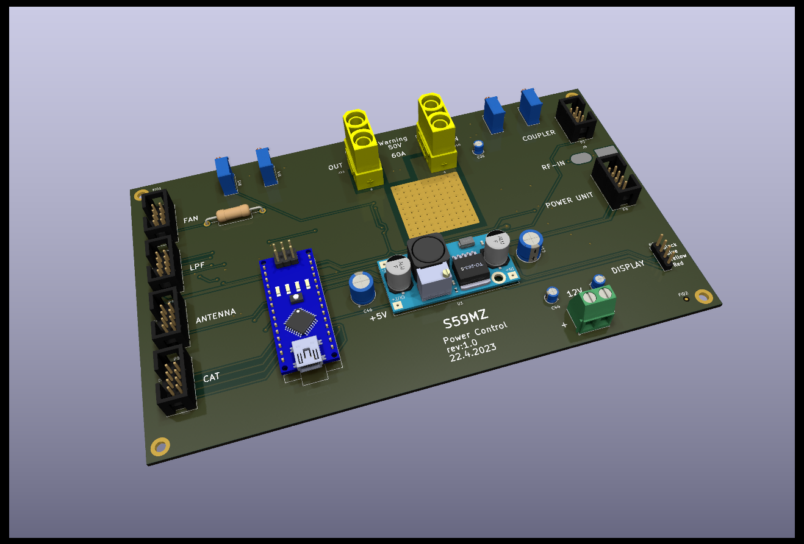
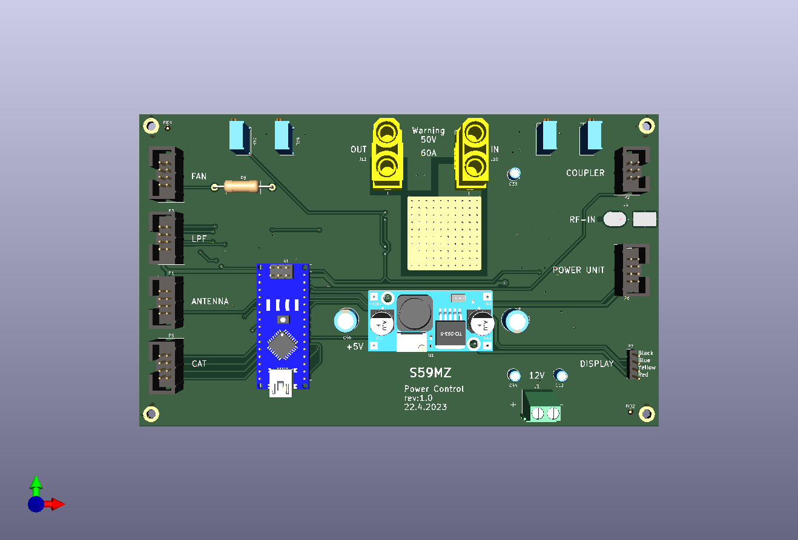
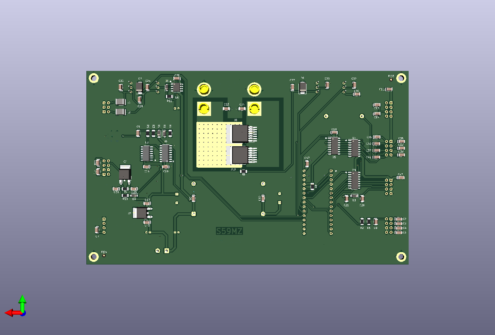

# kicad-lin_ctrl
Controller for HF Linear Power Amplifier

Schematic:
[Schematic.pdf](linear_controller.pdf)

BOM:
[BOM.csv](linear_controller.csv)

Gerbers:
[gerbers.zip](https://github.com/s59mz/kicad-lin_ctrl/raw/main/gerbers.zip)
